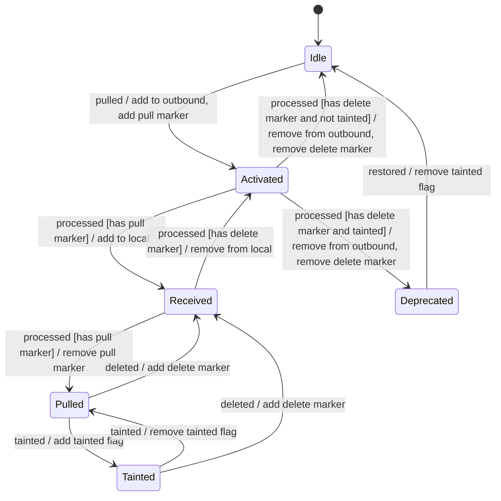

# Entity States
Links contain and operate on entities. A specific entity is unique within a link and can be part of one or more components (source, outbound, local).

## States
Each entity is in one of the following states at any given time:
* Idle: This is the default state that entities start in.
* Activated: The entity is in the process of being pulled/deleted to/from the local side. It is only present in the source side of the link.
* Received: The entity is in the process of being pulled/deleted to/from the local side. It is present in both sides of the link.
* Pulled: The entity has been copied from the source to the local side.
* Tainted: The entity was marked by the source side as faulty indicating to the local side to delete it.
* Deprecated: The entity was marked as tainted by the source side and subsequently deleted by the local side.

## Transitions
The following state diagram shows the different states that entities can be in and how they can transition between these states:

The diagram adheres to the following rule to avoid entities with invalid states due to interruptions (e.g. connection losses):

**Never modify both sides of the link during a single transition.**

Not following this rule can lead to entities in invalid states due to modifying one side of the link and then losing connection.

## Persistence
Storing an entity's state directly in the persistent layer is problematic because it makes it difficult to have state transitions that only modify one side of the link. An easier approach is to map the state an entity has in the domain model to the state it has in the persistent layer. This persistent state consists of the entity's presence in the three components and whether it has a marker and/or flag or not.

The following table illustrates the chosen mapping:

| Source | Outbound | Local | Marker | Tainted | State |
|--------|----------|-------|--------|---------|---------|
| :white_check_mark: | :x: | :x: | :x: | :x: | Idle |
| :white_check_mark: | :white_check_mark: | :x: | :white_check_mark: | :x: | Activated |
| :white_check_mark: | :white_check_mark: | :white_check_mark: | :white_check_mark: | :x: | Received|
| :white_check_mark: | :white_check_mark: | :white_check_mark: | :x: | :x: | Pulled |
| :white_check_mark: | :white_check_mark: | :white_check_mark: | :x: | :white_check_mark: | Tainted |
| :white_check_mark: | :x: | :x: | :x: | :white_check_mark: | Deprecated |

