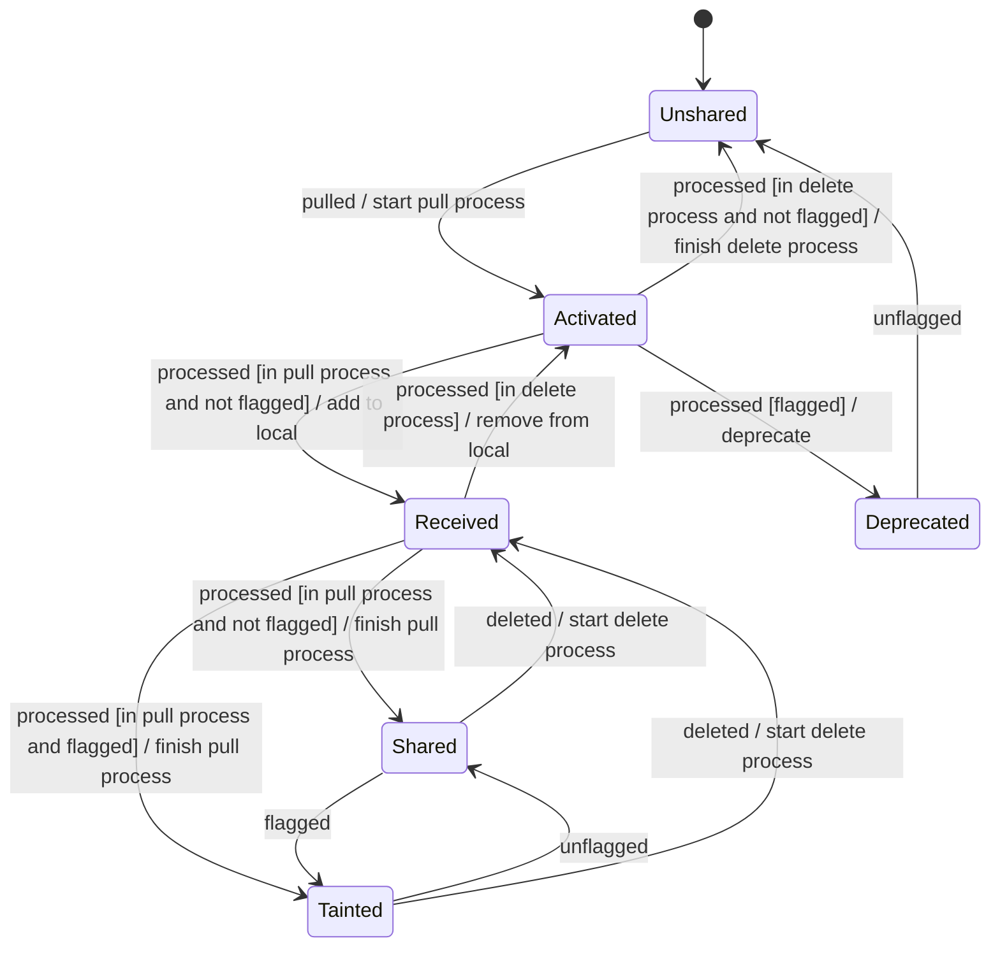
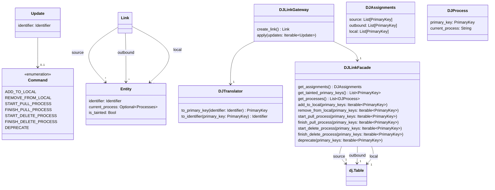

# Entity States
Links contain and operate on entities. A specific entity is unique within a link and can be part of one or more components (source, outbound, local).

## States
Each entity is in one of the following states at any given time:
* Unshared: This is the default state that entities start in.
* Activated: The entity is in the process of being pulled/deleted to/from the local side. It is only present in the source side of the link.
* Received: The entity is in the process of being pulled/deleted to/from the local side. It is present in both sides of the link.
* Shared: The entity has been copied from the source to the local side.
* Tainted: The entity was flagged by the source side indicating to the local side to delete it.
* Deprecated: The entity was flagged by the source side and subsequently deleted by the local side.

## Transitions
The following state diagram shows the different states that entities can be in and how they can transition between these states:

The diagram adheres to the following rule to avoid entities with invalid states due to interruptions (e.g. connection losses):

**Never modify both sides of the link during a single transition.**

Not following this rule can lead to entities in invalid states due to modifying one side of the link and then losing connection.

The `pulled`, `processed` and `deleted` events are triggered by the application, whereas the `flagged` and `unflagged` events are triggered by the source side directly by modifying the persistent data. The `flagged` and `unflagged` events are also not associated with activities for the same reason.

## Processes
Unshared entities can be pulled from the source side into the local side and once they are shared they can be deleted from the local side. Activated and received entities are currently undergoing one of these two processes. The name of the specific process is associated with entities that are in the aforementioned states. This allows us to correctly transition these entities. For example without associating the process with the entity we would not be able to determine whether an activated entity should become a received one (pull) or an unshared one (delete).

## Persistence

### Mapping States
Storing an entity's state directly in the persistent layer is problematic because it makes it difficult to have state transitions that only modify one side of the link. An easier approach is to map the state an entity has in the domain model to the state it has in the persistent layer. This persistent state consists of the entity's presence in the three components and whether it has an process and/or flag or not.

The following table illustrates the chosen mapping:

| In source          | In outbound        | In local           | Has process        | Is flagged               | State      |
|--------------------|--------------------|--------------------|--------------------|--------------------------|------------|
| :white_check_mark: | :x:                | :x:                | :x:                | :x:                      | Unshared   |
| :white_check_mark: | :white_check_mark: | :x:                | :white_check_mark: | :white_check_mark: / :x: | Activated  |
| :white_check_mark: | :white_check_mark: | :white_check_mark: | :white_check_mark: | :white_check_mark: / :x: | Received   |
| :white_check_mark: | :white_check_mark: | :white_check_mark: | :x:                | :x:                      | Shared     |
| :white_check_mark: | :white_check_mark: | :white_check_mark: | :x:                | :white_check_mark:       | Tainted    |
| :white_check_mark: | :white_check_mark: | :x:                | :x:                | :white_check_mark:       | Deprecated |

### Layout
In the case of DataJoint the persistent data is organized in three tables: Source, outbound and local. The source and local tables contain the full entities and the outbound table contains a subset of the primary keys of the entities present in the source table. Additionally the outbound table has three more columns: The first one contains the process associated with the entity (if any), the second one whether the entity is flagged or not and the third one whether the entity is deprecated or not.

### Mapping Activities
What specifically happens during the activities shown in the state diagram above depends on the underlying persistence system. In the case of DataJoint they are implement like so:
* Start pull process:
    1. Fetch entity's primary key from source table
    2. Add field with key `process` and value `PULL` to key
    3. Insert key into outbound table
* Finish pull process:
    1. Fetch entity from outbound table
    2. Set value of field with key `process` to `NONE`
    3. Delete entity from outbound table
    4. Insert updated entity into outbound table
* Start delete process:
    1. Fetch entity from outbound table
    2. Set value of field with key `process` to `DELETE`
    3. Delete entity from outbound table
    4. Insert updated entity into outbound table
* Finish delete process: Delete entity from outbound table
* Add to local:
    1. Fetch entity from source table
    2. Insert entity into local table
* Remove from local: Delete entity from local table
* Deprecate:
    1. Fetch entity from outbound table
    2. Set value of field with key `is_deprecated` to `True`
    3. Set value of field with key `process` to `NONE`
    4. Delete entity from outbound table
    5. Insert updated entity into outbound table

### Class Diagram
The following diagram shows the most important classes related to persistence. `Update`, `Command`, `Link` and `Entity` live in the domain model layer. `DJLinkGateway`, `DJTranslator` and `DJProcess` live in the adapter layer. `DJLinkFacade` and `dj.Table` live in the infrastructure layer.

